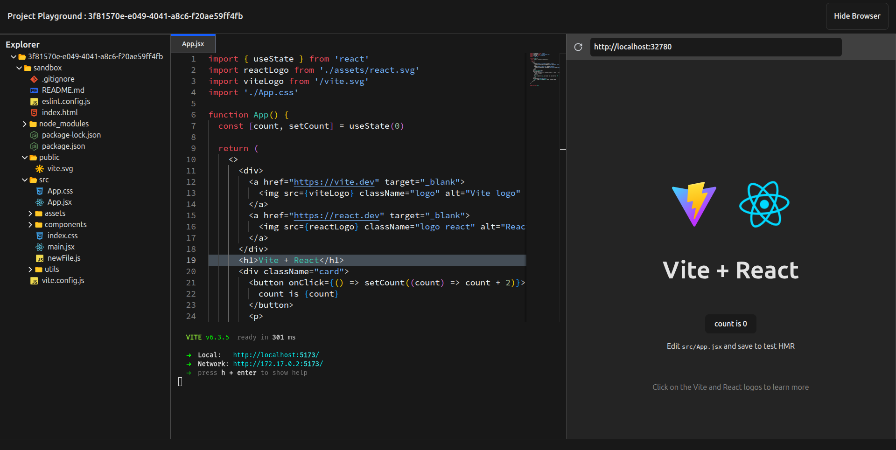

# ReactBox – A VS Code-like IDE for React Projects in the Browser 
> A lightweight in-browser IDE tailored for React — build, code, run, and preview your React apps instantly.


---

## Description

**ReactBox** lets you create and run React projects entirely in your browser. It offers a fully interactive development experience similar to VS Code — complete with a file explorer, syntax-highlighted code editor, real-time terminal, and a live browser preview panel.

---

## Features

- **File Explorer**  
  Create/delete files & folders in your project tree.

- **Code Editor**  
  Socket.io powered Text editor with syntax highlighting.

- **Interactive Terminal**  
  WebSocket-powered interactive terminal inside the browser.

- **Live Browser Preview**  
  Instantly view app changes with a built-in browser pane.

- **Real-time Sync**  
  Editor, terminal, and preview panel stay in sync live.

- **Clean UI**  
  Clean and minimal UI with all resizable components.
---

## Tech Stack

| Layer     | Tech |
|-----------|------|
| Frontend  | React, Tailwind CSS |
| Backend   | Node.js, Express |
| Sockets   | socket.io (for editor), raw WebSocket (for terminal) |
| Containers | Docker (for running React app in isolated conatiner), Dockerode |
| Editor/Terminal | Monaco Editor, Xterm.js |

---

## Local Setup Instructions

### 1. Clone the Repository

```bash
git clone https://github.com/satyanandshreyash/ReactBox.git
cd ReactBox
```
### 2. Frontend Setup

```bash
cd frontend
touch .env
```
#### inside `.env` file

```makefile
VITE_BACKEND_URL=http://localhost:3000
```

#### Install Dependencies

```bash
npm install
```

### 3. Backend Setup

```bash
cd backend
touch .env
```
#### inside `.env` file

```makefile
PORT=3000
REACT_PROJECT_COMMAND=npm create vite@latest sandbox -- --template react

```

#### Install Dependencies

```bash
npm install
```

#### Build Docker Image using `Dockerfile`

```bash
docker build -t sandbox .
```
### 4. Start the App

#### Start Backend Server

```bash
cd backend
npm run dev

```

#### Start Frontend Server

```bash
cd frontend
npm run dev
```

---

### 5. Open the App in your Browser

    Open http://localhost:5173 to view the app.
